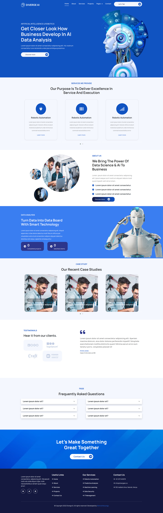

# Diverge AI

DivergAI is a business website for Artificial Intelligence enthusiasts built using React JS, utilizing React Components, Router and State Hooks.

### A sneek peek of the Application

## Tech Stack Used

1. React JS
2. Bootstrap5/ Html5/JavaScript/CSS3

## Known Bugs

Owl Carousel responsive is the current bug, but pull requests are allowed incase you spot any other bug

## Contribution

Pull requests are welcome. For major changes, please open an issue first to discuss what you would like to change.

Please make sure to update tests as appropriate.

## Project Author

Name: Nimrod Musungu  
Email: nimrod.chitayi@gmail.com 
Website: nimrodmusungu.com
